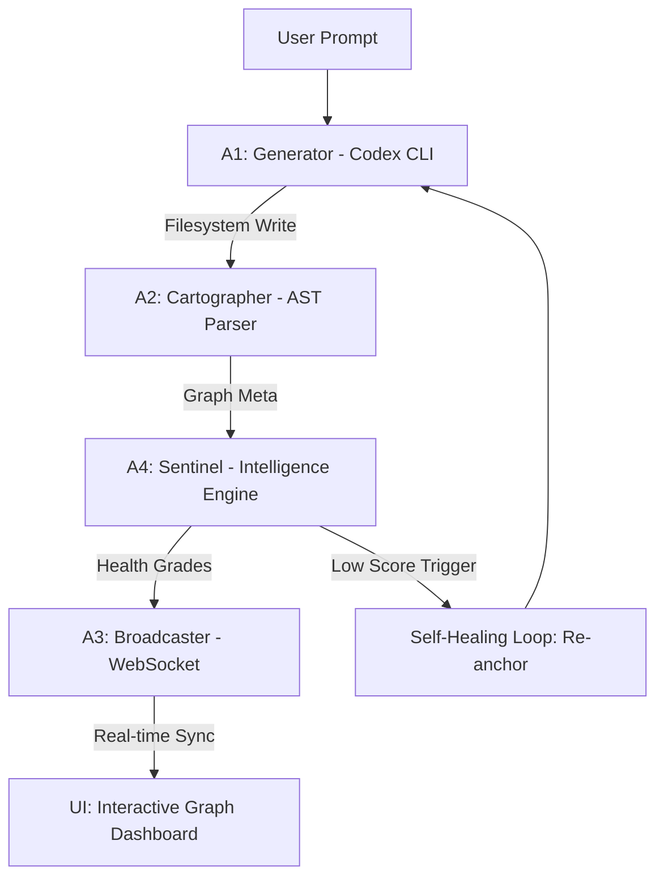

# CodexMap: The Observability Layer for AI-Generated Systems

> **Mapping the invisible evolution of AI-driven codebases in real-time.**

---

## 1. Executive Summary

As AI agents move from writing simple scripts to managing complex, multi-file systems, developers face a critical **Observability Gap**. **CodexMap** bridges this gap by providing a real-time, high-fidelity "Control Plane" for AI-generated code. It transforms non-deterministic AI outputs into a visual, interactive dependency graph, governed by deterministic architectural "Skills" and heuristic scoring.

---

## 2. System Architecture

CodexMap operates as a multi-agent orchestration layer, ensuring that every line of code is tracked from generation to deployment.

### The Orchestration Pipeline:
1.  **A1: Generator:** Interacts with the **Codex CLI** in `--approval-mode auto-edit`.
2.  **A2: Cartographer:** Uses **Babel AST parsing** and regex fallbacks to decompose files into stable logical nodes (Functions, Classes, Imports).
3.  **A3: Broadcaster:** Managed WebSocket layer that diffs and batches graph updates to ensure 60FPS UI performance.
4.  **A4: Sentinel:** The primary brain. Runs the **5-Component Hybrid Scoring Engine** to detect context drift.

---

## 3. The Sentinel Intelligence Engine

The heart of CodexMap is the **Sentinel**, which performs non-deterministic evaluation against deterministic project intents. It produces a composite health score (0.0 to 1.0) for every node.

### 5-Component Scoring Matrix

| Component | Logic | Weight | Purpose |
| :--- | :--- | :--- | :--- |
| **S1: Semantic** | Cosine Similarity (Vector Embeddings) | 20% | Measures baseline intent alignment. |
| **S2: Reasoning** | Cross-Encoder & PageIndex Logic | 40% | Validates structural and logical coherence. |
| **A: Architectural** | DNA Anchoring & Import Graph Fit | 20% | Ensures code resides in the correct module domain. |
| **T: Type/Role** | AST Validation & Keyword Intensity | 20% | Checks for language-specific best practices. |
| **D: Drift Penalty** | Anti-Pattern & Subsystem Detection | -30% | Penalizes "hallucinated" features (e.g., unwanted Stripe APIs). |

> [!IMPORTANT]
> **Definitive Formula:** `S_final = (0.2*S1) + (0.4*S2) + (0.2*A) + (0.2*T) - (0.3*D)`

---

## 4. Enterprise-Grade Safety & Governance

### The Collapse Warning System
CodexMap detects the "point of no return" for AI-generated subsystems before they require manual refactoring.

> [!CAUTION]
> **Architectural Collapse Signals:**
> *   **Entropy Surge:** Red node density exceeds 40% of the active codebase.
> *   **Spaghetti Growth:** Edge count (dependencies) grows >3× the baseline rate in 5 minutes.
> *   **Complexity Spike:** Average Cyclomatic Complexity per node doubles from the initial anchor.

### Skills & Compliance (`SKILL.md`)
The system is governed by a local `SKILL.md` framework—a set of deterministic "ground rules" for the AI agents:
*   **Black-Box Safety:** Agents never parse non-deterministic CLI output; all truth is derived from the **Cartographer's FS Watcher**.
*   **Atomic State Management:** Use of temporary buffer writes and rename-swaps prevents data corruption during high-frequency map updates.

---

## 5. Rigorous Evaluation Harness

CodexMap is built on a foundation of measurable reliability. The system includes a comprehensive **Evaluation Suite** that benchmarks the Sentinel engine against both synthetic and ground-truth datasets.

### Metrics & Methodology

*   **Heal-Efficiency (Mean Score Delta):** The `heal_eval` harness quantifies recovery success. It measures the **Mean Score Delta (MSD)** before and after an automated re-anchoring loop. The system maintains a rigorous success threshold of **Δ > 0.15** for all self-healing operations.
*   **Drift Recall & Latency:** Using the `inject_drift` stress-tool, the system purposefully introduces out-of-scope logic (e.g., hallucinated payment gateways) to measure the Sentinel’s sensitivity. Key KPIs include:
    *   **Detection Recall:** The percentage of synthetic drift events correctly identified as "Red."
    *   **Detection Latency:** Time-to-flag (measured in seconds) from injection to UI alert.
*   **Semantic Precision Benchmarking:** The `score_accuracy` suite compares heuristic scores against a **Ground Truth Registry**, ensuring the 5-component formula remains aligned with human architectural intent.
*   **Pipeline Performance:** Latency testing across the Babel AST parser and WebSocket broadcaster ensures the system scales to codebases exceeding 1,000+ nodes without UX degradation.

---

## 6. Codex Ecosystem Integration

CodexMap leverages the full power of the Codex platform through specialized plugins and skills:

*   **Codex CLI App:** Orchestrates the generative lifecycle and manages the re-anchoring process for drifted nodes.
*   **PageIndex Plugin:** Builds a deep-index system tree, allowing the Sentinel to "reason" across file boundaries without exceeding context limits.
*   **Cross-Encoder Scaling:** Uses dedicated reasoning nodes to perform secondary logic validation, ensuring high-fidelity outputs for production systems.

---

## 6. Visual Design Philosophy

Inspired by the **Coinbase** design language, the CodexMap interface prioritizes **Trust and Clarity**:
*   **High-Contrast Binary Palette:** Coinbase Blue (`#0052ff`) accents on a pure white/near-black grid.
*   **Visual Hierarchy:** Ultra-tight display typography (1.00 line-height) and pill-shaped interactive CTAs.
*   **Dynamic Depth:** Real-time micro-animations on node grades, signaling the system's "pulse."

---

## 7. Strategic Roadmap

*   **Phase 1:** Autonomous Debugging Agents (Fixing Reds without human intervention).
*   **Phase 2:** CI/CD Guardrail Integration (Blocking merges on Drift > 0.40).
*   **Phase 3:** Multi-Agent Observability (Tracking cross-agent communication protocols).

---

**Built with pride by @Somu.ai for the OpenAI Codex Hackathon 2025.**
